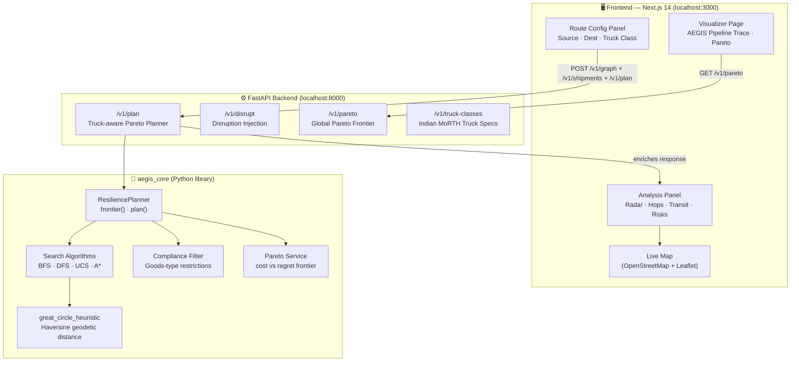

# AEGIS — Resilience-Aware Logistics Planning

AEGIS answers: *how badly does a feasible delivery plan fail when conditions change, and what cost premium buys less failure?*

---

## Architecture



### Key design decisions

| Decision | Rationale |
|---|---|
| Pareto frontier over single plan | Decision-maker gets the full cost vs. regret trade-off spectrum, not a black-box single answer |
| Indian MoRTH / CMVR 1989 truck classes | Payload and GVW limits match actual permit categories (LCV → MHCV), so the planner rejects physically infeasible loads |
| Risk score = 0.5 × norm_cost + 0.5 × regret | Equal-weight combination picks the route that is neither the costliest nor the most fragile |
| OSM Nominatim geocoding | No API key required; any Indian address or pin-code resolves to a lat/lon and is stitched into the logistics graph via feeder corridors |

---

## Quick start (Docker — recommended)

```bash
# 1. Clone and configure
cp .env.example .env          # edit if needed (keys are pre-set for local dev)

# 2. Launch everything
docker compose up --build

# 3. Open the UI
open http://localhost:3000

# 4. Explore the API docs
open http://localhost:8000/docs   # Header: X-API-Key: local-dev-key
```

Docker spins up: **FastAPI** · **Next.js**.

---

## Local development (no Docker)

### Backend

```bash
# Python 3.11+
python3.11 -m venv .venv && source .venv/bin/activate

# Install aegis_core (editable) + API dependencies
pip install -e ./core -e ./sdk -r services/api/requirements.txt

# Copy env
cp .env.example .env

# Start the API (auto-reload on file change)
uvicorn services.api.app.main:app --reload --port 8000
```

### Frontend

```bash
cd frontend
npm install
npm run dev          # http://localhost:3000
```

> Both services can run simultaneously. The Next.js dev server proxies API calls to `http://localhost:8000` via `NEXT_PUBLIC_API_URL`.

---

## Environment variables

| Variable | Default | Description |
|---|---|---|
| `AEGIS_API_KEY` | `local-dev-key` | API key sent as `X-API-Key` header |
| `NEXT_PUBLIC_API_URL` | `http://localhost:8000` | Backend URL consumed by the Next.js frontend |

---

## How the AEGIS algorithm works

```
1. Load graph      POST /v1/graph       → depots (nodes) + routes (edges) with cost, time_hours, risk_prior
2. Load shipment   POST /v1/shipments   → origin, destination, goods_type, weight_kg
3. Truck check     POST /v1/plan        → cargo_weight_kg > max_payload_kg → HTTP 422 (rejected)
4. Search          ResiliencePlanner.frontier()
                     └─ UCS sweeps a risk-weight grid, enumerating feasible paths
                     └─ Each path scored on: baseline cost + expected regret under each disruption
                     └─ λ-sweep builds the full cost-vs-regret Pareto frontier
5. Enrich          For each plan:
                     └─ Identify disruptions whose edge_id ∈ route_ids → potential_risks[]
                     └─ Aggregate risk_score (exponential-decay weighting of severities)
                     └─ is_best = argmin(0.5 × norm_cost + 0.5 × risk_score)
6. Return          list[PlanResponse] — one entry per Pareto-optimal plan
```

---

## Truck classes (Indian standards — MoRTH / CMVR 1989)

| Key | Category | Max Payload | GVW Limit |
|---|---|---|---|
| `lcv` | Light Commercial Vehicle | 3,500 kg | 7,500 kg |
| `icv` | Intermediate Commercial Vehicle | 7,000 kg | 12,000 kg |
| `mcv` | Medium Commercial Vehicle | 10,000 kg | 16,200 kg |
| `hcv` | Heavy Commercial Vehicle (2-axle) | 16,200 kg | 25,000 kg |
| `hcv_multi` | HCV Multi-Axle (national permit) | 25,000 kg | 40,200 kg |
| `mhcv` | Over-Dimensional Cargo (special permit) | 40,000 kg | 55,000 kg |

The planner rejects a shipment whose `weight_kg` exceeds the selected class's max payload and returns HTTP 422 with a human-readable message.

---

## Project layout

```
AEGIS/
├── core/                   # aegis_core — pure Python
│   └── aegis_core/
│       ├── algorithms/
│       │   └── search.py   # BFS, DFS, UCS, A*, Greedy, Hill-Climbing
│       ├── domain/
│       │   └── models.py   # Depot, Route, Shipment, Plan, Disruption
│       └── services/
│           ├── compliance.py
│           ├── risk.py
│           └── pareto.py
├── services/
│   └── api/                # FastAPI — planning endpoints
│       └── app/
│           ├── main.py     # Route handlers + AEGIS orchestration
│           ├── schemas.py  # PlanRequest, PlanResponse, DisruptionInfo, TRUCK_CLASSES
│           ├── fuel_service.py  # State-aware ₹ fuel/toll/driver cost model
│           ├── store.py    # In-memory state (graph, shipments, plans, disruptions)
│           └── config.py
├── frontend/               # Next.js 14 dashboard
│   ├── app/
│   │   ├── page.tsx        # Live map + glass-morphic control drawer
│   │   └── visualizer/     # Dynamic graph visualisation page
│   ├── components/
│   │   ├── MapView.tsx
│   │   ├── SourceDestPicker.tsx  # Truck class + address inputs
│   │   ├── AnalysisPanel.tsx     # Metrics, truck spec, risks, recommendation
│   │   ├── AegisTraceGraph.tsx   # Pipeline stage visualisation
│   │   ├── MiniGameTree.tsx      # Min/max game-tree demo
│   │   └── EventConsole.tsx      # Live event stream
│   └── lib/
│       ├── api.ts          # Typed API client
│       ├── constants.ts    # India backbone network (depots + routes)
│       └── dynamicGraph.ts # OSM geocoding + feeder corridor injection
├── sdk/                    # Python SDK (optional programmatic access)
├── examples/               # Sample JSON payloads
└── docs/
    ├── architecture.md
    ├── algorithms.md
    └── implementation-plan.md
```

---

## API reference (key endpoints)

| Method | Path | Description |
|---|---|---|
| `POST` | `/v1/graph` | Upload depot + route graph |
| `POST` | `/v1/shipments` | Register shipments |
| `POST` | `/v1/plan` | Run AEGIS — returns Pareto-optimal plans with truck check, risks, `is_best` |
| `GET` | `/v1/truck-classes` | List all supported Indian truck classes |
| `POST` | `/v1/disrupt` | Inject a disruption (road closure, strike, etc.) |
| `POST` | `/v1/plan/{id}/replan` | Replan after disruption |
| `POST` | `/v1/plan/aegis-trace` | Stage-by-stage pipeline trace (visualiser) |
| `GET` | `/v1/pareto` | Global Pareto frontier across all stored plans |
| `GET` | `/v1/metrics` | Prometheus metrics |
| `WS` | `/v1/stream/simulation` | Live simulation event stream |

Interactive docs: **http://localhost:8000/docs** (Swagger UI)

---

## Running tests

```bash
# Backend
source .venv/bin/activate
pytest core/tests/ services/api/tests/ -v

# Lint
ruff check .

# Frontend type-check
cd frontend && npx tsc --noEmit
```

---

## Included examples

- `examples/last_mile_weather.json` — weather disruption on a perishable shipment
- `examples/multi_depot_strike.json` — labour strike closing multiple edges simultaneously

See [docs/implementation-plan.md](docs/implementation-plan.md), [docs/architecture.md](docs/architecture.md), and [docs/algorithms.md](docs/algorithms.md) for deeper reading.
